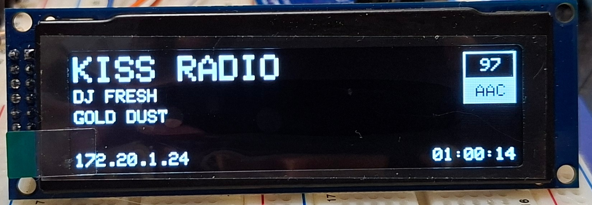

## [CZ] Yoradio: Walda's Edition

[<i>English version bellow</i>]

Projekt YoRadio představuje přehrávač internetových rádií založený na platformě ESP32. Hardwarová konfigurace typicky zahrnuje externí DA převodník, displej, tlačítka a rotační enkodéry.

V rámci vlastní implementace byly provedeny dílčí úpravy a rozšíření funkčnosti oproti původní verzi projektu.

Původní projekt je dostupný v repozitáři GitHub: https://github.com/e2002/yoradio

Upravená verze vychází ze zdrojových kódů publikovaných přibližně v polovině roku 2025. Oproti této verzi byly realizovány následující změny:

* implementace funkce autocommit
* úprava grafického rozhraní a vzhledu zobrazovaných obrazovek.

#### Autocommit

Autor umožňuje ovládání přehrávače prostřednictvím tlačítek, rotačních enkodérů nebo dotykového displeje. Kombinace těchto ovládacích prvků je variabilní, přičemž nejefektivnější se jeví použití jediného enkodéru, konkrétně ENC2. Pohybem enkodéru doleva nebo doprava se přepíná mezi režimem přehrávače (zobrazení času, názvu stanice a dalších informací) a režimem playlistu (seznam stanic nahraných do ESP prostřednictvím webového rozhraní).

V režimu playlistu lze vybrat požadovanou stanici a spuštění probíhá stiskem enkodéru. Tento způsob ovládání však vykazuje jednu nevýhodu: při stisku enkodéru dochází často k nechtěnému pohybu enkodéru, což může vést ke spuštění jiné stanice, než byla zamýšlena.

Funkce autocommit řeší tuto situaci tím, že pokud v režimu playlistu enkodér přestane být otáčen, považuje se aktuální volba stanice za potvrzenou. Po uplynutí dvou sekund je tato stanice automaticky spuštěna, bez nutnosti dalšího stisku enkodéru.

Technicky jde o drobné úpravy ve třech souborech: <i>myoptions.h</i>, <i>timekeeper.cpp</i> a <i>display.cpp</i>. Co se měnilo je <a href="__walda_mod__/autocommit_mod.png">ZDE</a>. 

Zde je video jak to funguje:

#### Vzhled displeje

Pro realizaci přehrávače byl zvolen OLED displej s řadičem SSD1322. Jedná se o monochromatický displej s podporou stupňů šedi, s rozlišením 256 × 64 pixelů, černým pozadím a světlými (bílými) obrazovými body.

Původní grafické rozhraní obsahovalo výrazné digitální hodiny, inverzní zobrazení názvu stanice, grafický indikátor hlasitosti a další prvky. Přestože bylo funkční, výsledné provedení nevyhovovalo požadovanému stylu zobrazení.

Cílem úpravy bylo vytvořit konzervativně pojaté uživatelské rozhraní se zobrazením pouze základních informací a bez nadbytečných grafických prvků. Výjimku tvoří čtverec zobrazující datový tok (bitrate) a použitý kodek, který se mi velmi libí.

Upozornění: Použití jiného typu displeje může vést k nesprávnému zobrazení. Některé části zdrojového kódu jsou navrženy obecně, nicméně úpravy byly provedeny specificky s ohledem na parametry použitého displeje. Zachování plné kompatibility s jinými zobrazovacími moduly by vyžadovalo odlišnou implementaci, vyšší míru abstrakce a následné důkladné testování, což nebylo předmětem této úpravy.

#### Hardware

Níže jsou uvedeny odkazy na použitý hardware. Nelze zaručit jejich dlouhodobou dostupnost, nicméně všechny komponenty představují běžně dostupné a standardně používané moduly odpovídající požadavkům projektu YoRadio. Nejedná se o žádné speciální ani atypické součástky.

PCM5102 PCM5102A DAC Decoder Board I2S Input 32Bit 384K for Red Core Player Supports I2S format/left justified
https://www.aliexpress.com/item/1005006012626189.html

ESP32 WROOM-32 Development Board TYPE-C CH340C/ CP2102 WiFi+Bluetooth Ultra-Low Power Consumption Dual Core Wireless Module
https://www.aliexpress.com/item/1005005953505528.html

Real OLED Display 3.12" 256*64 25664 Dots Graphic LCD Module Display Screen LCM Screen SSD1322 Controller Support SPI
https://www.aliexpress.com/item/1005003091450549.html

Rotary Encoder Module Brick Sensor Development Round Audio Rotating Potentiometer Knob Cap EC11
https://www.aliexpress.com/item/1005006986329518.html

V dokumentaci projektu YoRadio je k dispozici konfigurátor i přehled zapojení jednotlivých pinů pro použité komponenty.

Je však vhodné upozornit na jednu praktickou skutečnost: konfigurátor přiřazuje vstupy rotačního enkodéru na piny, které nemají interní pull-up rezistory. V takovém případě je nutné zajistit externí pull-up odpory. Rotační enkodéry z výše uvedeného odkazu jsou vybaveny malou přídavnou deskou plošných spojů, na které jsou pull-up odpory již osazeny. Pro správnou funkci proto stačí kromě signálových vodičů a GND připojit také napájení 3,3 V (3V3).

## [EN] Yoradio: Walda's Edition

[<i>Machine translation</i>]

The YoRadio project is an internet radio player based on the ESP32 platform. The typical hardware configuration includes an external DAC, a display, push buttons, and rotary encoders.

In my implementation, several minor modifications and functional enhancements were made compared to the original project version.

The original project is available on GitHub:
https://github.com/e2002/yoradio

The modified version is based on the source code published around mid-2025. Compared to that version, the following changes were implemented:

* implementation of the autocommit function
* modification of the display layout and screen appearance

#### Autocommit

The YoRadio firmware allows the player to be controlled using push buttons, rotary encoders, or a touchscreen. These control elements can be combined in various ways; however, using a single rotary encoder (ENC2) proved to be the most practical solution. Rotating the encoder left or right switches between the player mode (displaying time, station name, and other information) and the playlist mode (a list of stations uploaded to the ESP via the web interface).

In playlist mode, a station can be selected and started by pressing the encoder. This control method has one drawback: when pressing the encoder, it is easy to unintentionally rotate it slightly, which may result in starting a different station than intended.

The autocommit function addresses this issue. If the encoder stops rotating while in playlist mode, the currently selected station is considered confirmed. After a two-second timeout, the station is started automatically without requiring an additional press of the encoder.

From a technical perspective, this modification involves minor changes in three files: myoptions.h, timekeeper.cpp, and display.cpp. The specific code modifications can be found <a href="__walda_mod__/autocommit_mod.png">HERE</a>.

Here is a video showing how it works:

#### Display Layout

An OLED display with the SSD1322 controller was selected for this build. It is a monochrome display with grayscale support and a resolution of 256 × 64 pixels, featuring a black background with bright (white) pixels.

The original graphical interface included large digital clock digits, an inverted station name, a graphical volume indicator, and several additional visual elements. Although fully functional, the overall appearance did not match the intended visual style.

The goal of the modification was to create a more conservative user interface showing only essential information, without unnecessary graphical decorations. The only preserved visual element beyond the basics is the square indicator displaying the current bitrate and audio codec, which provides useful real-time information and complements the layout.

Note: Using a different display type may result in incorrect rendering. While some parts of the source code are written in a generic way, the modifications were implemented specifically with the parameters of the selected display in mind. Ensuring full compatibility with other display modules would require a different implementation approach, a higher level of abstraction, and thorough testing, which was outside the scope of this modification.

#### Hardware

Below are links to the hardware used. Long-term availability of the exact listings cannot be guaranteed; however, all components are standard, commonly available modules that meet the requirements of the YoRadio project. No special or uncommon parts are required.

PCM5102 PCM5102A DAC Decoder Board I2S Input 32Bit 384K for Red Core Player Supports I2S format/left justified
https://www.aliexpress.com/item/1005006012626189.html

ESP32 WROOM-32 Development Board TYPE-C CH340C/ CP2102 WiFi+Bluetooth Ultra-Low Power Consumption Dual Core Wireless Module
https://www.aliexpress.com/item/1005005953505528.html

Real OLED Display 3.12" 256*64 25664 Dots Graphic LCD Module Display Screen LCM Screen SSD1322 Controller Support SPI
https://www.aliexpress.com/item/1005003091450549.html

Rotary Encoder Module Brick Sensor Development Round Audio Rotating Potentiometer Knob Cap EC11
https://www.aliexpress.com/item/1005006986329518.html

One practical detail should be noted: the configurator assigns the rotary encoder inputs to GPIO pins without internal pull-up resistors enabled. In such a case, external pull-up resistors are required.

The rotary encoders linked above include a small PCB on the back side with pull-up resistors already populated. For proper operation, it is therefore sufficient to connect the signal lines, GND, and the 3.3 V supply (3V3).

